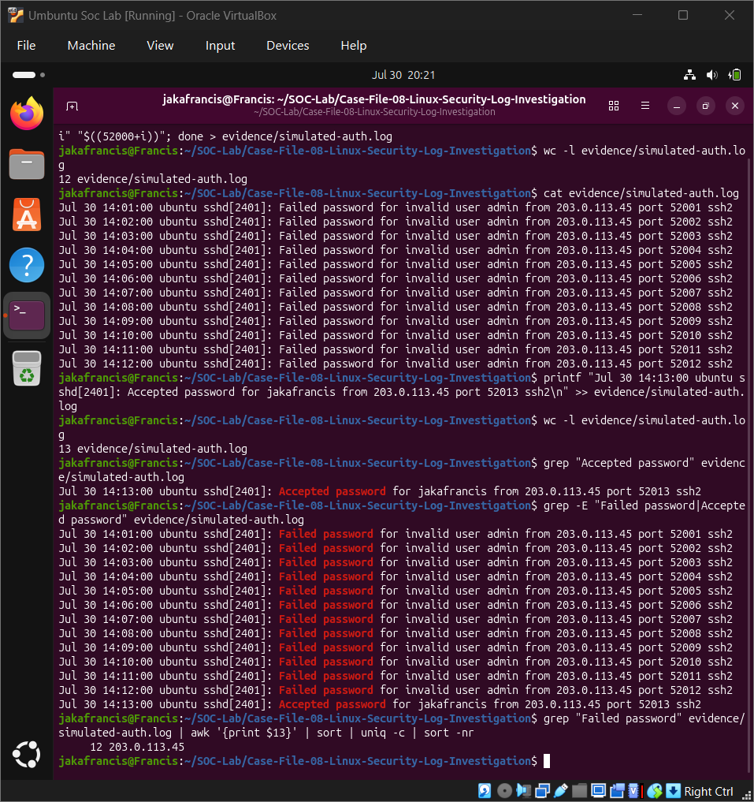
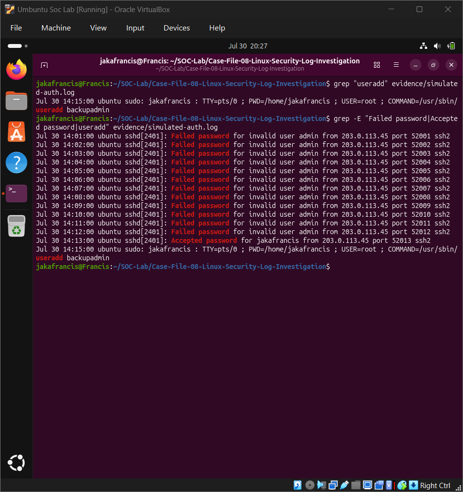
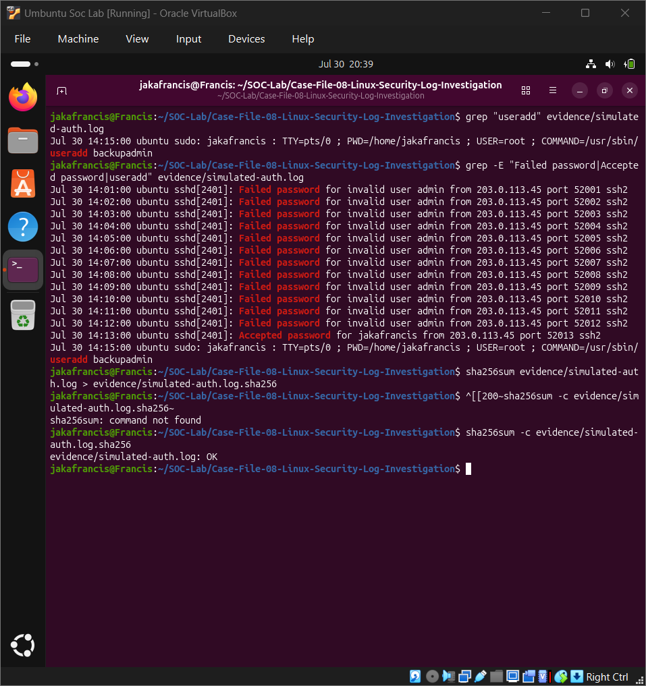
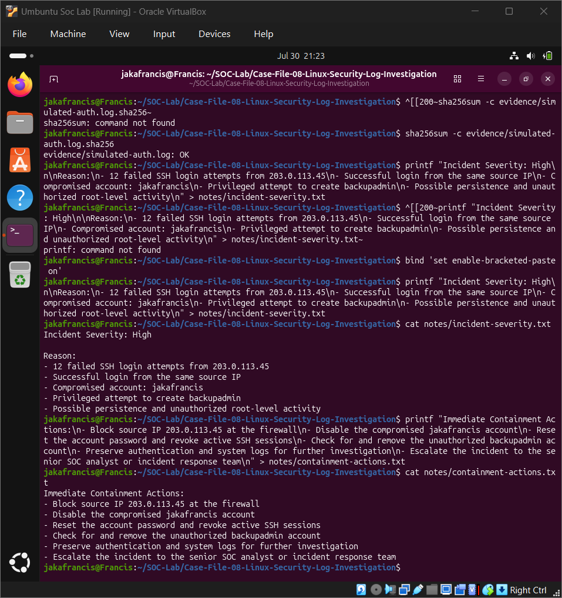
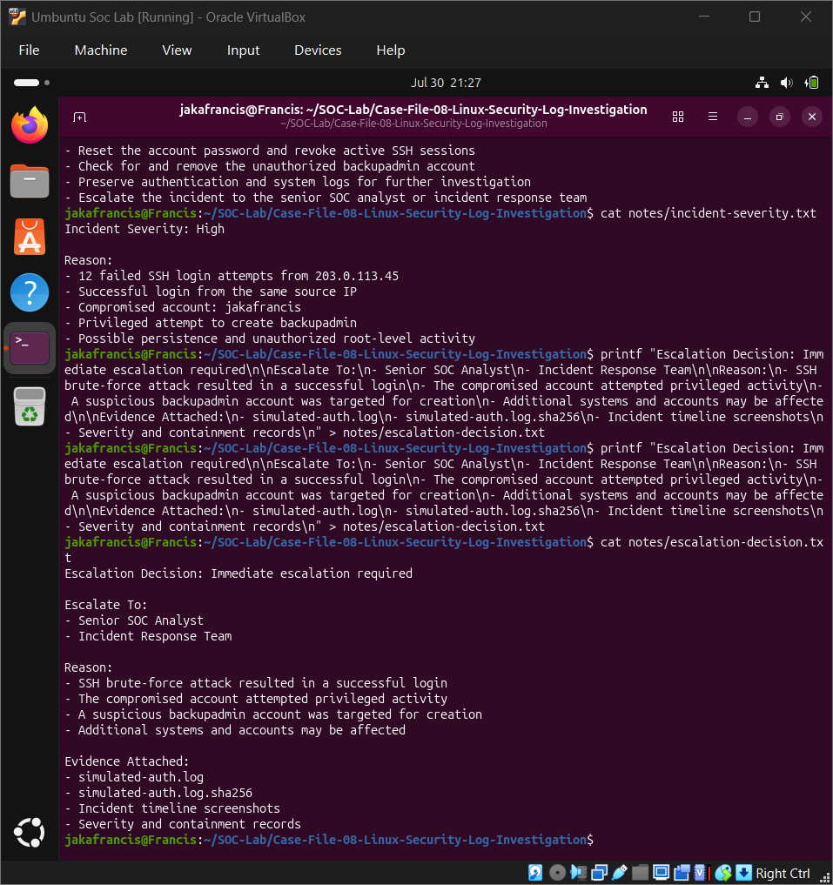

# Case File 09: SSH Brute-Force and Account Compromise Investigation

## Overview

In this investigation, I analyzed simulated Linux SSH authentication logs to identify a brute-force attack that resulted in a successful account compromise and an attempted persistence action.

The investigation showed 12 failed SSH login attempts from one source IP, followed by a successful login from the same IP. Shortly afterward, the compromised account attempted to create a suspicious administrator-style account named `backupadmin`.

## Investigation Objectives

- Identify repeated failed SSH login attempts
- Determine the main attacking source IP
- Detect whether the attacker successfully accessed an account
- Investigate suspicious activity after the successful login
- Build a complete incident timeline
- Assign an incident severity
- Recommend containment and escalation actions
- Verify preserved evidence using SHA-256

## Tools and Commands Used

- Ubuntu Linux
- Linux authentication logs
- `grep`
- `awk`
- `sort`
- `uniq`
- `sha256sum`
- Bash
- VirtualBox

## Key Findings

| Finding | Result |
|---|---|
| Source IP | `203.0.113.45` |
| Failed SSH attempts | 12 |
| Targeted username | `admin` |
| Compromised account | `jakafrancis` |
| Failed-login period | `14:01–14:12` |
| Successful login | `14:13` |
| Suspicious activity | `14:15` |
| Persistence attempt | Creation of `backupadmin` |
| Incident severity | High |

## Failed Attempts by Source IP

The failed SSH events were grouped and counted by source IP. The analysis confirmed that `203.0.113.45` generated all 12 failed login attempts.

## Complete Incident Timeline

The full timeline connected the initial brute-force activity, successful account access, and suspicious post-compromise activity:

- `14:01–14:12` — 12 failed SSH login attempts
- `14:13` — Successful login from the same source IP
- `14:15` — Attempt to create the suspicious `backupadmin` account

## Evidence Integrity Verification

A SHA-256 hash was created for the simulated authentication log. The integrity check returned `OK`, confirming that the evidence still matched its saved digital fingerprint.

## Incident Classification

This incident was classified as a likely successful SSH brute-force account compromise with an attempted persistence action.

The incident was assigned **High Severity** because:

- The attacker successfully accessed an account
- The successful login came from the same IP responsible for the failed attempts
- The compromised account attempted privileged activity
- The attacker attempted to create an additional account for possible persistent access

## Recommended Containment

- Block `203.0.113.45` at the firewall
- Disable the compromised `jakafrancis` account
- Reset the account password
- Revoke all active SSH sessions
- Check for and remove the unauthorized `backupadmin` account
- Preserve authentication and system logs
- Investigate other accounts and systems for related activity

## Escalation Decision

Immediate escalation to a Senior SOC Analyst and the Incident Response Team was recommended because the attacker gained access and attempted privileged persistence.

## Evidence Files

- `simulated-auth.log`
- `simulated-auth.log.sha256`
- `final-incident-report.txt`
- Investigation screenshots

## MITRE ATT&CK Mapping

| Technique | ID | Connection |
|---|---|---|
| Brute Force: Password Guessing | `T1110.001` | Repeated SSH password attempts |
| Valid Accounts: Local Accounts | `T1078.003` | Successful use of a valid local account |
| Create Account: Local Account | `T1136.001` | Attempted creation of `backupadmin` |

## Conclusion

The failed SSH logins, successful access, and attempted creation of `backupadmin` formed one continuous incident timeline. The evidence supported a likely account compromise and attempted persistence, requiring immediate containment and escalation.

> This investigation used simulated authentication logs in a controlled home-lab environment. No real account was compromised.
